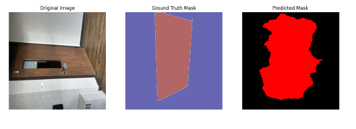

# **DeepLabV3 Semantic Segmentation Project**

## **Overview**

This project implements semantic segmentation using the **DeepLabV3** architecture with a **ResNet-50 backbone**. The primary goal is to classify pixel-level features in images into three classes: doors, stairs, and background. The project demonstrates an end-to-end workflow, including dataset preparation, model training, evaluation, and deployment.

---

## **Key Features**

- **Custom Dataset:** A manually annotated dataset for doors and stairs, prepared using COCO format and tools like CVAT and Roboflow.
- **Deep Learning Model:** Utilized transfer learning with DeepLabV3 and ResNet-50 pre-trained on the COCO dataset.
- **Metrics and Visualizations:** Achieved **Mean IoU: 62.76%**, **Mean Accuracy: 80.90%**, and **Pixel Accuracy: 82.99%**. Visualization of predictions included.
- **Deployment:** Real-time image segmentation using **Gradio**, with a web interface for easy interaction.

---

## **Technologies Used**

- **Programming Language:** Python
- **Deep Learning Frameworks:** PyTorch, torchvision
- **Annotation Tools:** CVAT, Roboflow
- **Parameter Analysing Tools:** ClearML
- **Deployment:** Gradio, FastAPI
- **Evaluation Metrics:** Mean IoU, Pixel Accuracy, Mean Accuracy
- **Visualization:** Matplotlib, Gradio interface

---

## **Project Structure**

- **`dl_project_update_1.ipynb`:** Initial dataset preparation and model setup.
- **`DL_project_update2_Final.ipynb`:** Final training, evaluation, and hyperparameter tuning.
- **`Deployment.ipynb`:** Deployment pipeline, including Gradio-based interface.

---

## **Setup Instructions**
Note: GPU is required for the project to run. You can use Google Colab.
### **1. Clone the Repository**
```bash
git clone https://github.com/yashnayi234/Semantic-Segmentation-using-DeepLabV3.git
cd Semantic-Segmentation-using-DeepLabV3
```
### **2. Install Dependencies**
Install the required Python packages:
```bash
pip install -r requirements.txt
```

### **3. Dataset Preparation**
Ensure the dataset is structured in the following format:
```
Datasets/
├── train/
├── valid/
├── test/
├── annotations/
    ├── train_annotations.coco.json
    ├── valid_annotations.coco.json
    ├── test_annotations.coco.json
```

### **4. Train the Model**
Run the notebook `DL_project_update2_Final.ipynb` to train the model. Fine-tune hyperparameters as required.

### **5. Deploy the Model**
Run `Deployment.ipynb` to deploy the model using Gradio. Access the segmentation interface at the provided URL.

---

## **Usage**

### **Upload Images**
- Upload an image in the Gradio interface to get pixel-wise segmentation results.
- Classes:
  - **0:** Background (Black)
  - **1:** Door (Red)
  - **2:** Stair (Green)

---

## **Results**

### **Evaluation Metrics**
- **Mean IoU:** 62.76%
- **Mean Accuracy:** 80.90%
- **Pixel Accuracy:** 82.99%

### **Visualizations**
Predictions include:
- Original image
- Ground truth mask
- Predicted mask

---
## **Sample Output**

Below is an example of the semantic segmentation result:



- **Left:** Input Image
- **Center:** Ground Truth Mask
- **Right:** Predicted Mask

## **Future Enhancements**

- Extend the dataset with more classes and samples.
- Experiment with advanced architectures like DeepLabV3+.
- Deploy the model using Docker for enhanced scalability.

---


## **Acknowledgments**

Special thanks to tools like Roboflow, PyTorch, and Gradio for enabling the development of this project.

---


## Team Members:
- **Yash Raythatha**
- **Parin Patel**
- **Yash Nayi**
